```mermaid
sequenceDiagram
    participant user
    participant browser
    participant server
    
    user->>browser: Complete text area and click in sumbit button

    browser->>server: POST https://studies.cs.helsinki.fi/exampleapp/new_note
    activate server
    server->>browser: Response 302
    deactivate server

    browser->>server: GET https://studies.cs.helsinki.fi/exampleapp/notes
    activate server
    server->>browser: HTML document
    deactivate server

    browser->>server: GET https://studies.cs.helsinki.fi/exampleapp/main.css
    activate server
    server->>browser: CSS file
    deactivate server

    browser->>server: GET https://studies.cs.helsinki.fi/exampleapp/main.css
    activate server
    server->>browser: JavaScript file
    deactivate server

    Note right of browser: Browser executes JS code that request JSON data from server

    browser->>server: GET https://studies.cs.helsinki.fi/exampleapp/data.json
    activate server
    server->>browser: [{"content": "Penguin 🐧", "date": "2025-02-02T17:34:04.676Z"}, ...]
    deactivate server

    Note right of browser: Browser executes the event handler that renders notes to display
```

# Sequence Diagram: Exercise 04

```
sequenceDiagram
    participant user
    participant browser
    participant server
    
    user->>browser: Complete text area and click in sumbit button

    browser->>server: POST https://studies.cs.helsinki.fi/exampleapp/new_note
    activate server
    server->>browser: Response 302
    deactivate server

    browser->>server: GET https://studies.cs.helsinki.fi/exampleapp/notes
    activate server
    server->>browser: HTML document
    deactivate server

    browser->>server: GET https://studies.cs.helsinki.fi/exampleapp/main.css
    activate server
    server->>browser: CSS file
    deactivate server

    browser->>server: GET https://studies.cs.helsinki.fi/exampleapp/main.css
    activate server
    server->>browser: JavaScript file
    deactivate server

    Note right of browser: Browser executes JS code that request JSON data from server

    browser->>server: GET https://studies.cs.helsinki.fi/exampleapp/data.json
    activate server
    server->>browser: [{"content": "Penguin 🐧", "date": "2025-02-02T17:34:04.676Z"}, ...]
    deactivate server

    Note right of browser: Browser executes the event handler that renders notes to display
```

