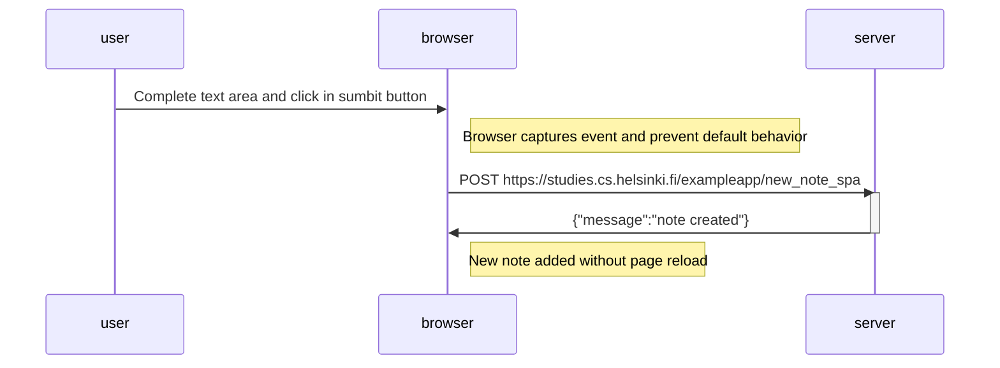

# Sequence Diagram: Exercise 06

```
sequenceDiagram
    participant user
    participant browser
    participant server

    user->>browser: Complete text area and click in sumbit button
    
    Note right of browser: Browser captures event and prevent default behavior

    browser->>server: POST https://studies.cs.helsinki.fi/exampleapp/new_note_spa
    activate server
    server->>browser: {"message":"note created"}
    deactivate server

    Note right of browser: New note added without page reload
```

